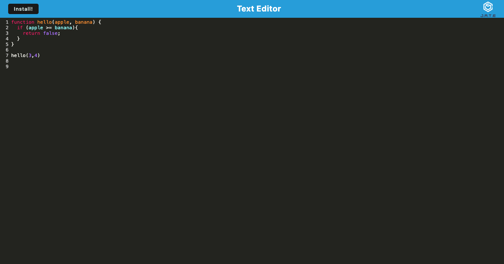

# [Text Editor](https://mysterious-waters-41175-892c9507152d.herokuapp.com/)

  ## Table of Contents
  - [Description](#description📝)
  - [Installation](#installation💻)
  - [Usage](#usage👨‍💻)
  - [Features](#features🎁)
  - [Credits](#credits📣)
  - [Resources](#resources🛠️)
  - [License](#licenses🔍)

## Description📝
PWA that formats the colors of JavaScritp code for easy visibility.

## Installation💻
The provided URL will redirect users to a user-friendly website, obviating the need for any user-initiated installations. This application supports most browsers.

The application may also be installed by pressing the "Install!" button on the upper left corner.
- [Source Code Link](https://github.com/JMorante89/Text-Editor)
- [Live Demo Link](https://mysterious-waters-41175-892c9507152d.herokuapp.com/)

## Usage👨‍💻
### To start, type JavaScript code into the editor and you will see the colors change accorging to your code text.

### For easier access, you may download the app directly to your computer by pressing the install button

## Features🎁
    -Colorful text that displays your JavaScript code
    -Easy readability
    -Install option to use offline

 ## Credits📣
- Daniel Morante 
  [Github Profile JMorante89](https://github.com/JMorante89)

## Resources🛠️
- GWU tutoring

## Licenses🔍
   